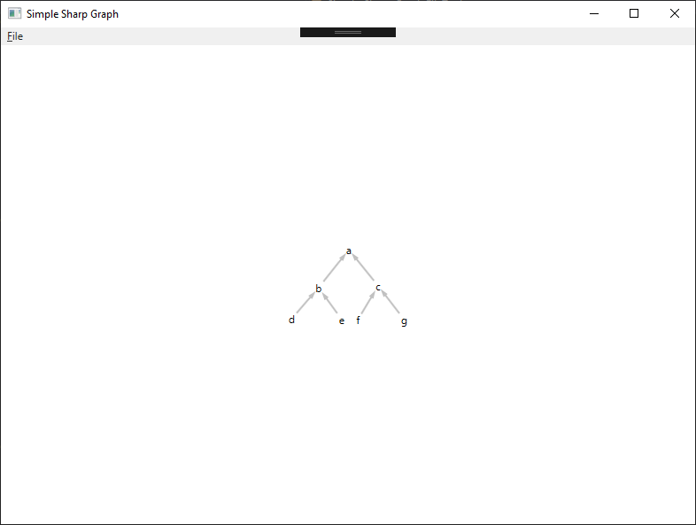

Simple Sharp Graph
==================================

**Simple Sharp Graph** is very simple software for parsing and displaying graphs based on custom language. This project implements own DSL for solving problem of data input for graphs.


## Requirements

* Windows operating system
* Visual Studio 2015 with .Net Framework 4.6.1


## Source code

You can also download latest version of source code using git. To do that enter bellow commands in your terminal:
> git clone https://github.com/bilek993/Simple-Sharp-Graph.git

or

> git clone git@github.com:bilek993/Simple-Sharp-Graph.git


## Language syntax

This project named **Simple Sharp Graph** uses domain specific language for simple and efficent drawing graphs. This language has very simple syntax and is based only on simple concept of edges and vertices.

To create new vertex you have to first declare it. For declaring vertices you have to name it. Before name of your new edge you have to place dot. Example:

```
.vertex1
```

To connect one vertex to another you have to specify name of it, then use arrow operator (->) and specify name of second vertex. Example:

```
vertex1->vertex2
```


## Usage

After successful build you can run the application. After that you can select file from top menu. You can create your of graph description file, but in this example we will use this:

```
.a .b .c
.d .e .f
.g

b->a
c->a
d->b
e->b
f->c
g->c
```

This example will create 6 vertices and connect them in a tree style. Output of this file will look like this:



## License

This application is licensed under [GPL-3.0](LICENSE). More information can be found [here](https://www.gnu.org/licenses/gpl-3.0.en.html).

## Authors

This application is developed by Jakub Biliński. You can find out more about me on my website: [jbilinski.pl](http:/www.jbilinski.pl).